# EDA Report – 2025-11-01 01:25
Analyzed 22405 matches.

## Basic Statistics
|        |    patch | winner   |   duration | blue_Top_champion   | blue_Top_class   | blue_Top_subclass   | blue_Jungle_champion   | blue_Jungle_class   | blue_Jungle_subclass   | blue_Mid_champion   | blue_Mid_class   | blue_Mid_subclass   | blue_ADC_champion   | blue_ADC_class   | blue_ADC_subclass   | blue_Support_champion   | blue_Support_class   | blue_Support_subclass   | red_Top_champion   | red_Top_class   | red_Top_subclass   | red_Jungle_champion   | red_Jungle_class   | red_Jungle_subclass   | red_Mid_champion   | red_Mid_class   | red_Mid_subclass   | red_ADC_champion   | red_ADC_class   | red_ADC_subclass   | red_Support_champion   | red_Support_class   | red_Support_subclass   |   blue_cluster |   red_cluster |            PCA1 |            PCA2 |
|:-------|---------:|:---------|-----------:|:--------------------|:-----------------|:--------------------|:-----------------------|:--------------------|:-----------------------|:--------------------|:-----------------|:--------------------|:--------------------|:-----------------|:--------------------|:------------------------|:---------------------|:------------------------|:-------------------|:----------------|:-------------------|:----------------------|:-------------------|:----------------------|:-------------------|:----------------|:-------------------|:-------------------|:----------------|:-------------------|:-----------------------|:--------------------|:-----------------------|---------------:|--------------:|----------------:|----------------:|
| count  | 22405    | 22405    |  22405     | 22405               | 22405            | 22405               | 22405                  | 22405               | 22405                  | 22405               | 22405            | 22405               | 22405               | 22405            | 22405               | 22405                   | 22405                | 22405                   | 22405              | 22405           | 22405              | 22405                 | 22405              | 22405                 | 22405              | 22405           | 22405              | 22405              | 22405           | 22405              | 22405                  | 22405               | 22405                  |    22405       |   22405       | 22405           | 22405           |
| unique |     1    | 2        |    nan     | 149                 | 7                | 14                  | 109                    | 7                   | 14                     | 156                 | 7                | 14                  | 118                 | 7                | 14                  | 130                     | 7                    | 14                      | 155                | 7               | 14                 | 114                   | 7                  | 13                    | 151                | 7               | 14                 | 117                | 7               | 14                 | 128                    | 7                   | 14                     |      nan       |     nan       |   nan           |   nan           |
| top    |    15.21 | blue     |    nan     | Ambessa             | Fighter          | Juggernaut          | Graves                 | Fighter             | Diver                  | Orianna             | Mage             | Burst               | Kaisa               | Marksman         | Marksman            | Nami                    | Controller           | Enchanter               | Ambessa            | Fighter         | Juggernaut         | Graves                | Fighter            | Diver                 | Orianna            | Mage            | Burst              | Kaisa              | Marksman        | Marksman           | Nami                   | Controller          | Enchanter              |      nan       |     nan       |   nan           |   nan           |
| freq   | 22405    | 11585    |    nan     | 1238                | 12878            | 4982                | 1647                   | 11258               | 6560                   | 1028                | 11919            | 6813                | 2273                | 19353            | 19340               | 1644                    | 12010                | 8099                    | 925                | 12925           | 5368               | 1534                  | 11242              | 6402                  | 1000               | 12006           | 6898               | 2349               | 19339           | 19323              | 1616                   | 12177               | 8192                   |      nan       |     nan       |   nan           |   nan           |
| mean   |   nan    | nan      |   1663.07  | nan                 | nan              | nan                 | nan                    | nan                 | nan                    | nan                 | nan              | nan                 | nan                 | nan              | nan                 | nan                     | nan                  | nan                     | nan                | nan             | nan                | nan                   | nan                | nan                   | nan                | nan             | nan                | nan                | nan             | nan                | nan                    | nan                 | nan                    |        1.96853 |       1.63937 |     4.66824e-16 |    -6.24758e-17 |
| std    |   nan    | nan      |    367.201 | nan                 | nan              | nan                 | nan                    | nan                 | nan                    | nan                 | nan              | nan                 | nan                 | nan              | nan                 | nan                     | nan                  | nan                     | nan                | nan             | nan                | nan                   | nan                | nan                   | nan                | nan             | nan                | nan                | nan             | nan                | nan                    | nan                 | nan                    |        1.4378  |       1.20428 |     3.94147     |     3.85354     |
| min    |   nan    | nan      |    303     | nan                 | nan              | nan                 | nan                    | nan                 | nan                    | nan                 | nan              | nan                 | nan                 | nan              | nan                 | nan                     | nan                  | nan                     | nan                | nan             | nan                | nan                   | nan                | nan                   | nan                | nan             | nan                | nan                | nan             | nan                | nan                    | nan                 | nan                    |        0       |       0       |    -8.64923     |    -9.67426     |
| 25%    |   nan    | nan      |   1452     | nan                 | nan              | nan                 | nan                    | nan                 | nan                    | nan                 | nan              | nan                 | nan                 | nan              | nan                 | nan                     | nan                  | nan                     | nan                | nan             | nan                | nan                   | nan                | nan                   | nan                | nan             | nan                | nan                | nan             | nan                | nan                    | nan                 | nan                    |        1       |       1       |    -3.57822     |    -2.45807     |
| 50%    |   nan    | nan      |   1674     | nan                 | nan              | nan                 | nan                    | nan                 | nan                    | nan                 | nan              | nan                 | nan                 | nan              | nan                 | nan                     | nan                  | nan                     | nan                | nan             | nan                | nan                   | nan                | nan                   | nan                | nan             | nan                | nan                | nan             | nan                | nan                    | nan                 | nan                    |        2       |       1       |     0.37643     |    -0.0584587   |
| 75%    |   nan    | nan      |   1876     | nan                 | nan              | nan                 | nan                    | nan                 | nan                    | nan                 | nan              | nan                 | nan                 | nan              | nan                 | nan                     | nan                  | nan                     | nan                | nan             | nan                | nan                   | nan                | nan                   | nan                | nan             | nan                | nan                | nan             | nan                | nan                    | nan                 | nan                    |        3       |       3       |     2.23364     |     2.37301     |
| max    |   nan    | nan      |   3631     | nan                 | nan              | nan                 | nan                    | nan                 | nan                    | nan                 | nan              | nan                 | nan                 | nan              | nan                 | nan                     | nan                  | nan                     | nan                | nan             | nan                | nan                   | nan                | nan                   | nan                | nan             | nan                | nan                | nan             | nan                | nan                    | nan                 | nan                    |        4       |       4       |    11.0972      |     9.87702     |

## Win Rate Distribution
|   blue_cluster |        0 |        1 |        2 |        3 |        4 |
|---------------:|---------:|---------:|---------:|---------:|---------:|
|              0 | 0.521971 | 0.518095 | 0.497103 | 0.52518  | 0.532225 |
|              1 | 0.500724 | 0.531569 | 0.521945 | 0.522572 | 0.502935 |
|              2 | 0.495979 | 0.518447 | 0.536017 | 0.530612 | 0.537102 |
|              3 | 0.502179 | 0.520152 | 0.503953 | 0.480769 | 0.475262 |
|              4 | 0.554286 | 0.526727 | 0.500664 | 0.537736 | 0.542411 |

## Top 15 Mutual Information Features
|                       |           0 |
|:----------------------|------------:|
| red_ADC_subclass      | 0.000673451 |
| red_ADC_class         | 0.000525881 |
| blue_Jungle_subclass  | 0.000451426 |
| red_Jungle_subclass   | 0.000444616 |
| blue_ADC_subclass     | 0.000405595 |
| blue_ADC_class        | 0.000368135 |
| blue_Mid_subclass     | 0.00035386  |
| red_Top_subclass      | 0.000352979 |
| red_Support_subclass  | 0.000335361 |
| blue_Jungle_class     | 0.000301624 |
| blue_Support_subclass | 0.0002964   |
| blue_Top_subclass     | 0.000235761 |
| red_Jungle_class      | 0.000224119 |
| red_Support_class     | 0.00022222  |
| blue_Top_class        | 0.000191179 |

## Top 15 Cramer's V Associations
|                       |         0 |
|:----------------------|----------:|
| red_ADC_subclass      | 0.0366101 |
| red_ADC_class         | 0.0323962 |
| red_Jungle_subclass   | 0.0297872 |
| blue_Jungle_subclass  | 0.0297161 |
| blue_ADC_subclass     | 0.0284251 |
| blue_ADC_class        | 0.0270925 |
| blue_Mid_subclass     | 0.0266077 |
| red_Top_subclass      | 0.0265342 |
| red_Support_subclass  | 0.0255247 |
| blue_Jungle_class     | 0.0245439 |
| blue_Support_subclass | 0.0239852 |
| blue_Top_subclass     | 0.0217084 |
| red_Jungle_class      | 0.0211748 |
| red_Support_class     | 0.0210434 |
| blue_Top_class        | 0.019553  |

## Generated Plots
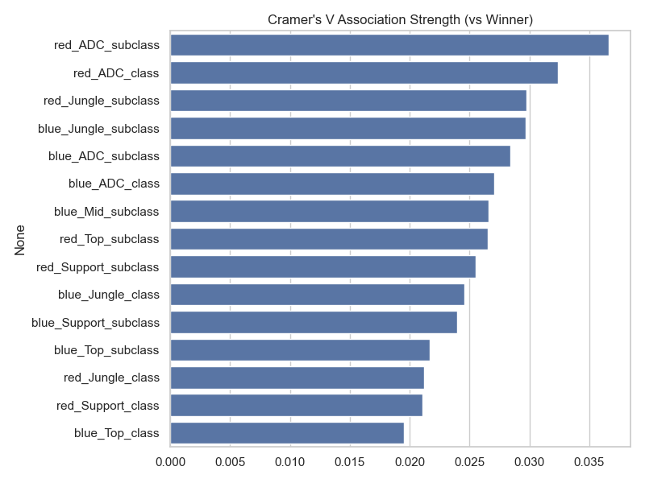
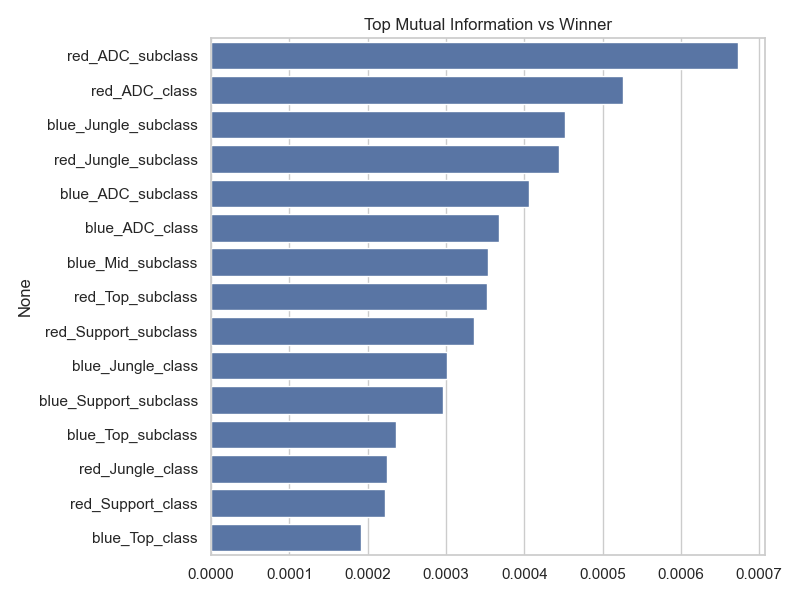
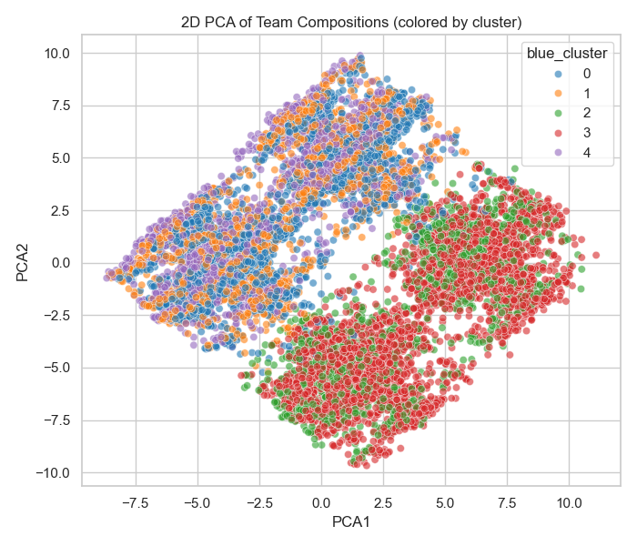

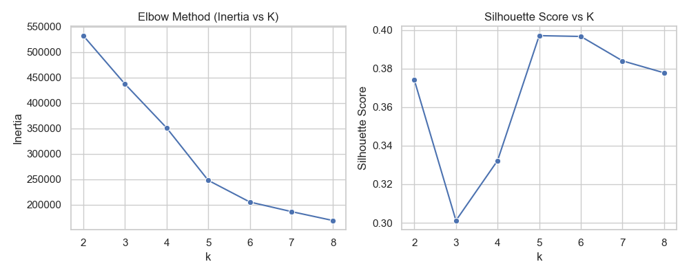
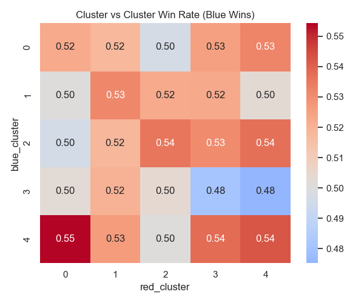
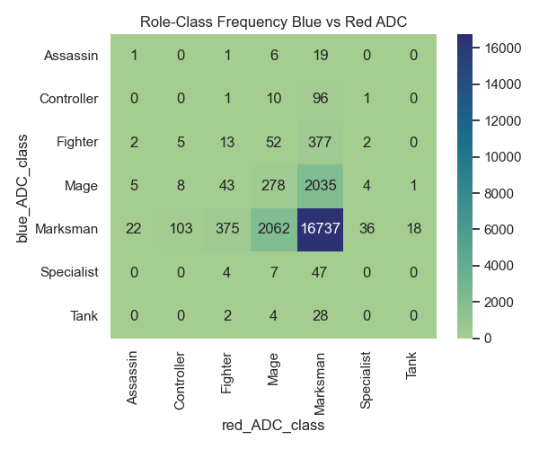
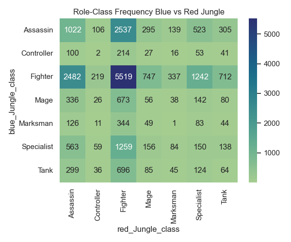
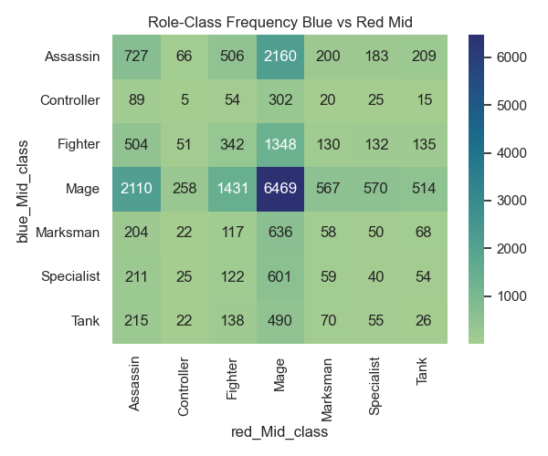
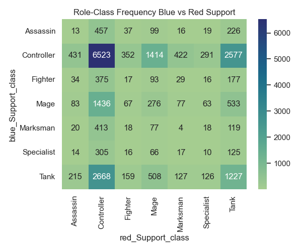
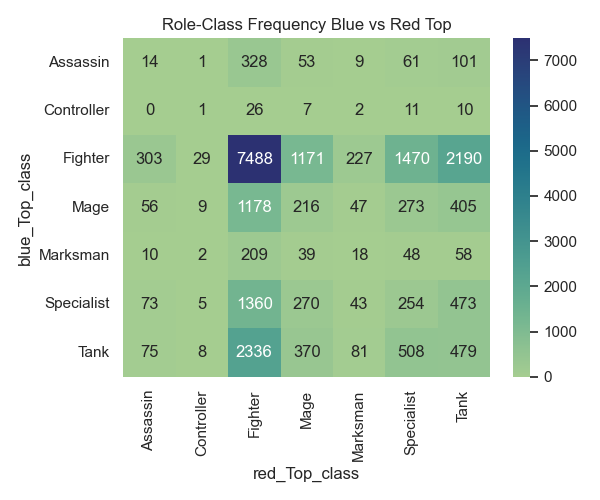
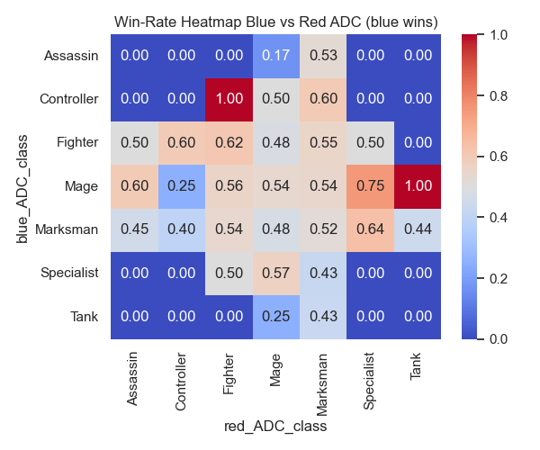
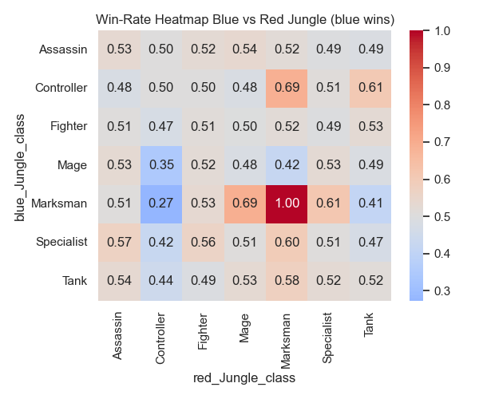
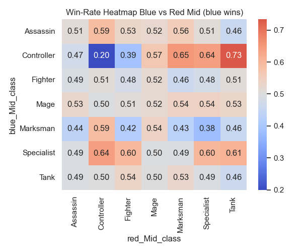
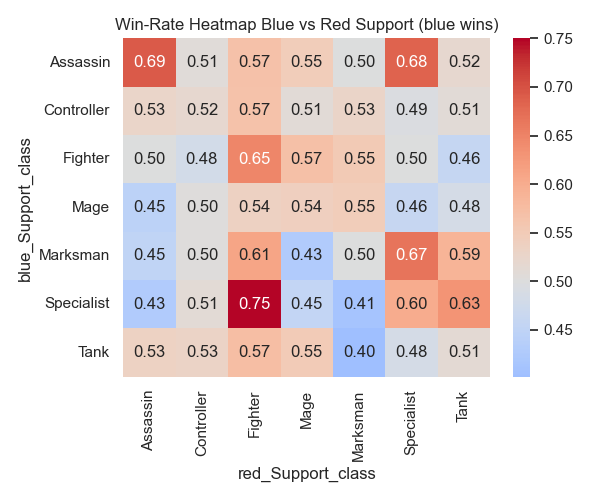
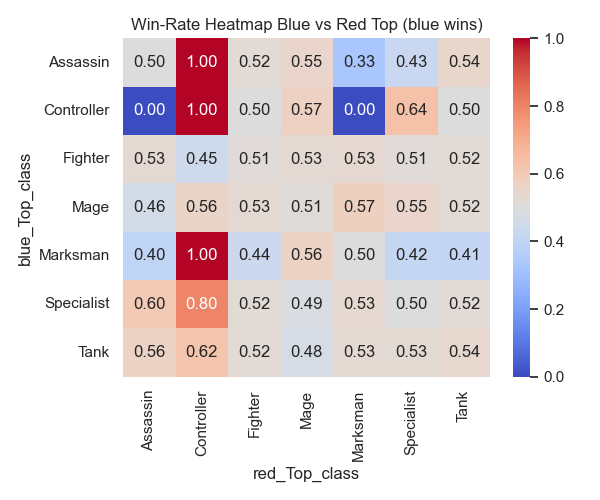
